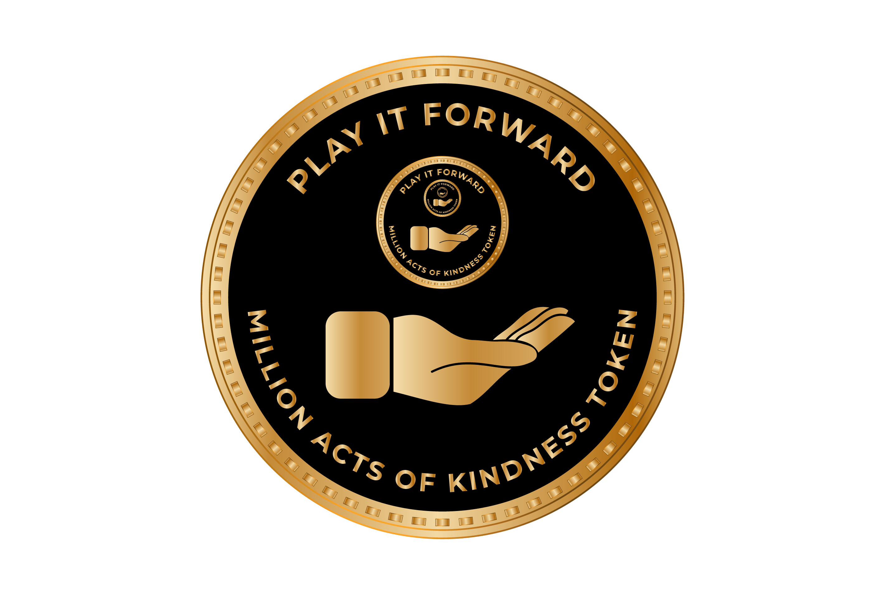

# Play It Forward (PFWD)

Million Acts Of Kindness - Token

## Description
`PlayItForward` (`PFWD`)&copy; is a decentralized digital `token` created by `developers` for `developers`.  **PlayItForward** token can be used as a digital currency to support `open-source` project owners, `YouTube` content creators, `podcast` creators, or simply anyone who deserves a helping-hand in achieving a greater good in benefiting communities in a positive way.

## Details
`PlayItForward` Token is minted with a fixed-supply of 1,000,000 tokens, and is pegged to a minimum value of 0.001 $USDC with a fixed-supply of 1,000,000 tokens, for a total initial market cap of 10,000.00+ $USDC.

## Mission
 `PlayItForward` Token was founded by an entrepreneur software architect, as a `social experiment`, not for the purpose of trade and quick profit. It was made as it needed to `exists`.

 `PlayItForward` Token can be seen as a `Million Acts Of Kindness` Token.  Millions of micro-transactions, if pointed at a right cause, can be very impactful.  

❤️ Happy Playing It Forward! ❤️

## PlayItForward Token Properties
 
#### `Fixed Supply of 1,000,000 token!`

`PlayItForward`'s source code guarantees that no more token can ever be created, making it a `deflationary` token by nature. `PlayItForward` is pegged to $USDC with the starting value of 0.001 $USDC. Its value can only increase over time due to possible scarcity.
  

#### `Store & Transactional value`
`PlayItForward` is a decentralized token, and it is secured by millions of computers worldwide on the Ethereum network.  `PlayItForward` can be used as a store value duo to its limited supply, making its upside, unlimited. It also can be transferred in tiny fractional amounts, making a great vehicle for micro-transactions.
  

# DISCLOSURE (must read)
 By purchasing `PlayItForward` Token, you `acknowledge` that you `understand`, and `agree` that you are **not** `purchasing a security` *nor* an `investment contract`.  You also `agree` to hold the team `harmless` and `not liable` for `any losses` or `taxes` you may incur. Please note that `PlayItForward` is a community driven DeFi Ecosystem and not a registered digital currency, always make sure that you are in compliance with your local laws and regulations before you make any transaction. Tokens, Cryptocurrencies are not legal tender and are not investments.

 Contact: info@playitforward.io